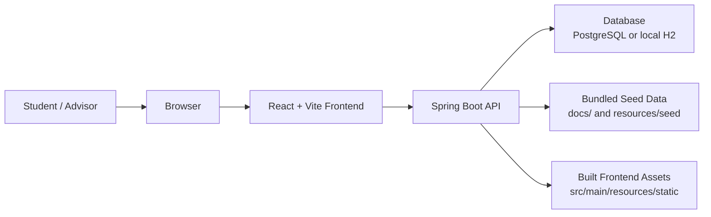
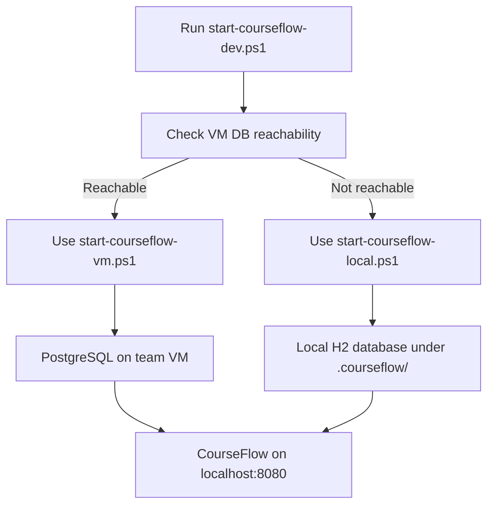
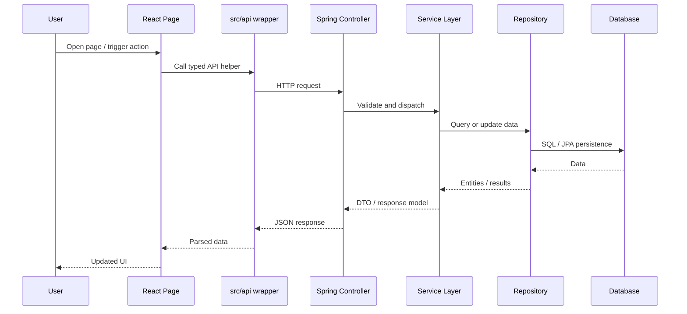
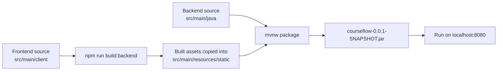
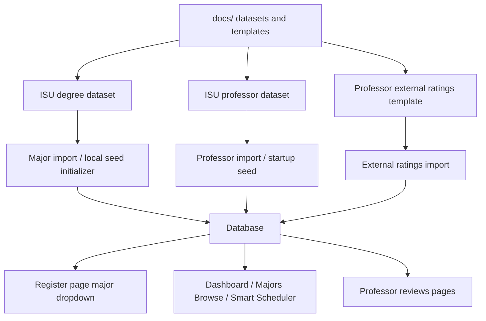
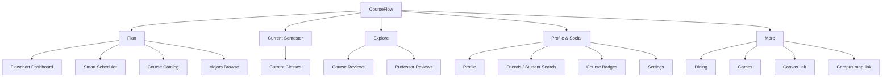
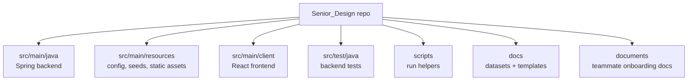
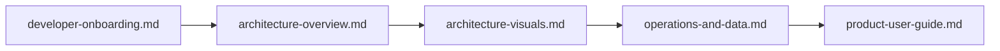

# Architecture Visuals

This file complements `architecture-overview.md` with diagrams that help a new teammate understand how CourseFlow is put together.

## 1. System Context

## 2. Runtime Modes

## 3. Frontend Request Flow

## 4. Build And Packaging Flow

## 5. Data Seeding And Import Pipeline

## 6. Product Area Map

## 7. Repo Layout Visual

## 8. Useful Reading Order For New Developers

## How To Use These Visuals

- Use the system context and runtime diagrams during teammate onboarding.
- Use the request flow diagram when debugging frontend-to-backend issues.
- Use the seed/import diagram when the database is empty or missing majors/professors.
- Use the product area map when planning navigation or deciding where a new feature belongs.
